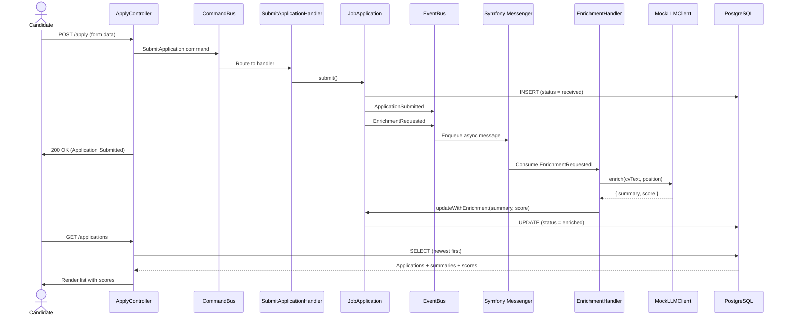

# Viterbit ATS PoC

A minimal **Application Tracking System (ATS)** demonstrating **DDD + Hexagonal Architecture + CQRS/Events** with asynchronous AI enrichment.

## Tech Stack

- **Framework**: Symfony 7.4+
- **CQRS / Messaging**: Ecotone (symfony-bundle)
- **Persistence**: Doctrine ORM (PostgreSQL)
- **Async Transport**: Symfony Messenger (Doctrine transport)
- **UI**: Twig + Symfony UX LiveComponents + Tailwind CSS
- **Testing**: PHPUnit + EcotoneLite + Behat
- **Quality**: PHP-CS-Fixer, PHPStan (max level), Deptrac

## Architecture

The codebase follows **Hexagonal Architecture** with bounded contexts:

```
src/
└── Application/              -- Bounded context
    ├── Domain/
    │   ├── Model/            -- Aggregates, Entities, Value Objects
    │   ├── Event/            -- Domain events
    │   └── Repository/         -- Interfaces (contracts)
    ├── Application/
    │   ├── Command/          -- Command DTOs
    │   ├── Query/            -- Query DTOs
    │   └── Handler/          -- Command/Query handlers
    └── Infrastructure/
        ├── Persistence/        -- Doctrine implementations
        ├── Messaging/          -- Ecotone async configuration
        └── Web/                -- Controllers, Components, Templates
```

**Key flows:**
- **Submit Application** → Command Bus → Aggregate → Domain Events → Event Bus
- **Enrichment Requested** → Async Consumer (Ecotone + Symfony Messenger) → Mock LLM → Update Application
- **List / Detail** → Query Bus → Repository → DTOs → Twig + LiveComponents

### Enrichment Flow (Mermaid)



## Getting Started

### Prerequisites

- Docker + Docker Compose
- Make

### Run Locally

```bash
make init          # Start containers, install deps, create DB, run migrations
```

Then open: [http://localhost:8080/apply](http://localhost:8080/apply)

### Other Commands

```bash
make up            # Start Docker services
make down          # Stop Docker services
make sh            # Shell into PHP container

make test          # Full PHPUnit suite
make test-unit     # Unit tests only
make test-integration  # Integration tests only
make behat         # E2E Behat tests

make cs-fix        # PHP-CS-Fixer
make stan          # PHPStan
make deptrac       # Architecture checks
make lint          # All linting tools
make validate      # Lint + test (all quality gates)

make install-hooks # Install pre-commit hook
```

## Product Features

### 1. Apply to a Job
- Page at `/apply` with job description and candidate form.
- CV input via **textarea** (plain text — no file upload).
- On submission: application stored with `appliedAt` and status `received`.
- An **asynchronous enrichment** is triggered automatically.

### 2. Browse Applications
- Page at `/applications` listing applications **newest first**.
- **Real-time filtering** by status, position, and free-text search (name/email).
- Sortable columns: name, position, status, score, applied at.
- Score badge visible inline for enriched applications.

### 3. Application Detail
- Page at `/applications/{id}` showing:
  - Candidate contact info and notes
  - Original CV text
  - AI-generated summary and relevance score
  - Status badge and applied-at timestamp

### 4. AI Enrichment (Async)
- After submission, an `EnrichmentRequested` domain event is published.
- An async handler consumes the event via Symfony Messenger + Ecotone.
- A **mock LLM client** generates a summary and a relevance score (0–100).
- The application is updated with the enrichment results.

## Testing

### Unit Tests
Pure domain logic: aggregates, value objects, handlers.

### Integration Tests
- Controller HTTP responses
- Query handlers
- Persistence (Doctrine repository)
- End-to-end enrichment flow

### Behat E2E
Full user journey via real Symfony kernel HTTP simulation:
```
Apply (POST /apply) → Run enrichment → List → Detail
```

## Quality Gates

| Tool          | Config                     |
|---------------|----------------------------|
| PHP-CS-Fixer  | `.php-cs-fixer.dist.php`   |
| PHPStan       | `phpstan.neon` (max level) |
| Deptrac       | `deptrac.yaml`             |

Run all gates:
```bash
make validate
```

A pre-commit hook runs the same checks automatically.

## Project Decisions

Architecture Decision Records (ADRs) are documented in `docs/adr/`.
